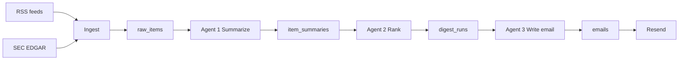

# Stock News — Weekly Investor Digest

A personal, once-a-week email of the most useful news and filings for a small named watchlist. You are the only user. Config lives in `app/profiles/`, not a signup product.

**Build order is inverted on purpose:** prove the two data surfaces first. Do not stand up Supabase, OpenAI, or Resend until ingest is visibly working.

## V1 cut

**Keep**

- RSS per ticker (Yahoo Finance). Volume is enough for 5–15 names. Google News search RSS was tried in the spike and dropped — it often returns an empty feed to a script.
- SEC EDGAR (official `data.sec.gov` submissions, not a paid “SEC API”). Filter to **8-K, 10-Q, 10-K, Form 4**. This is the investor-specific signal RSS misses.
- Three-agent LLM pipeline: summarize → rank → write email.
- Supabase Postgres, OpenAI, Resend, GitHub Actions weekly cron.

**Skip for V1**

- Company IR scraping (fragile, per-site, anti-bot). Revisit later if a specific company has a clean IR RSS/Atom feed — many do, and that is a cheap add.
- Price/quote APIs, multi-user auth, hosted always-on web API.

RSS alone usually fills an email. SEC is what makes it *investor* rather than *news*. Both stay in V1; IR waits.

## Stack

| Piece | Choice | Why |
|---|---|---|
| Language | Python 3.12 | Scrapers + agent pipeline |
| Jobs | CLI (`digest`) | `python -m digest run-weekly` locally; GitHub Actions in prod |
| Cron | GitHub Actions `schedule` | Free, secrets, good enough for one weekly run |
| DB | Supabase Postgres | One project, tables + optional dashboard |
| LLM | OpenAI | `gpt-4o-mini` for per-item summaries; a stronger model for rank + email |
| Email | [Resend](https://resend.com) | Simple API, good HTML, free tier is plenty for 1 email/week |
| Config | `app/profiles/` | `user.py` persona + `tickers.py` watchlist |

GitHub Actions runs the pipeline as a one-off script (checkout → install → `python -m digest run-weekly`). No web server.

Used when each phase needs it:

- Phase 1–2: Python 3.12, httpx, feedparser
- Phase 3: Supabase Postgres + Alembic
- Phase 4: OpenAI
- Phase 5: Resend, GitHub Actions
- Phase 6: Refactor (after the pipeline works end-to-end)
- Always: `app/profiles/` as the user profile (no user table)

## Watchlist config

Persona is `app/profiles/user.py`. Watchlist is `app/profiles/tickers.py` — append a dict to add a name:

```python
TICKERS = [
    {"symbol": "NVDA", "name": "NVIDIA"},
    {"symbol": "AAPL", "name": "Apple"},
    {"symbol": "MSFT", "name": "Microsoft"},
]
```

CIK lookup at ingest time from SEC’s public `company_tickers.json` (cached), so CIKs do not have to be hand-entered.

## Data model (Supabase)

Four tables, matching the agent stages. No user table — the profile lives in `app/profiles/`.

- **`raw_items`** — ingested payload
  - `id`, `source` (`rss` | `sec`), `ticker`, `title`, `url`, `published_at`
  - `raw_text` (RSS description/snippet, or SEC filing excerpt)
  - `external_id` (URL or EDGAR accession) — unique, for dedupe
  - `fetched_at`
- **`item_summaries`** — agent 1 output
  - `id`, `raw_item_id`, `summary`, `why_it_matters`, `item_type` (earnings / 8-K / product / other)
  - `model`, `created_at`
- **`digest_runs`** — one row per weekly job
  - `id`, `week_start`, `status`, `ranked_item_ids` (json), `rank_rationale`
- **`emails`** — agent 3 output + send log
  - `id`, `digest_run_id`, `subject`, `html_body`, `text_body`, `sent_at`, `resend_id`, `status`

## Pipeline



1. **Ingest** — For each ticker, pull Yahoo Finance RSS (feedparser) and SEC recent filings. Store text we can legally/easily get: RSS title + summary + link (no full-article scrape), SEC 8-K/10-Q header + first relevant section excerpt (capped, e.g. 8–12k chars). Dedupe on `external_id`. Window: last 7 days.
2. **Agent 1 (summarize)** — Loop unsummarized `raw_items`. Each call returns short JSON: summary, why it matters to an investor, type. Write `item_summaries`. Cheap model; skip items with empty text.
3. **Agent 2 (rank)** — One call with this week’s summaries + `ranking_criteria`. Returns top 5–10 ids plus a one-line reason each. Persist on `digest_runs`. If fewer than 5 items exist, send what we have rather than padding.
4. **Agent 3 (email)** — One call: ranked items + tone → subject + HTML + plaintext. Store, then Resend `emails.send`. Fail the job if send fails.

Idempotency: if a digest already exists for this `week_start`, skip (or `--force` locally).

## How SEC filings get summarized

Filings are not a pile of numbers. Most of what an investor cares about is prose plus a few tables, and the form type decides how much we send to the model.

| Form | What it really is | Typical size | What an investor wants |
|---|---|---|---|
| **8-K** | Something material happened — CEO left, acquisition, earnings release, guidance, lawsuit | Often short; Exhibit 99.1 is frequently a press release | The event, in plain English |
| **Form 4** | Insider bought/sold shares | Tiny, tabular | Who, buy vs sell, size, role |
| **10-Q** | Quarterly report: financials **and** MD&A (management’s written story of the quarter) | Long | Revenue/margin/EPS vs last year, guidance, one big risk or miss |
| **10-K** | Annual version of the above, plus business description and risk factors | Very long | Same idea, plus what changed in the business this year |

Agent 1 is not interpreting tone. It translates a disclosure into: what happened, the key numbers, and why it might matter. It only copies figures that are **in the text we send** — it should not invent a percentage from a filing we never provided.

**We do not send the whole 10-K or 10-Q to the LLM.** That is expensive, easy to truncate, and full of boilerplate.

**Always summarize (small, high signal)**

- 8-K cover page + item list (Item 2.02 earnings, Item 5.02 officer departure, etc.)
- Exhibit 99.1 earnings release when present
- Form 4 (or the SEC submissions JSON fields: form, date, reporting owner)

**Do not dump the whole document for V1**

- Full 10-Q / 10-K HTML. Treat these as a headline item: title like `AAPL 10-Q filed 2026-08-01`, EDGAR link, optional first chunk of Item 2 MD&A only (capped, e.g. 8–12k characters). Prompt: extract 3–5 investor facts; if the excerpt is incomplete, say so and do not invent numbers.

RSS stays as title + snippet + link. No full-article scrape.

Same JSON shape for news and filings, with `item_type` so the email can group them:

```json
{
  "item_type": "earnings",
  "summary": "Amazon 8-K: Q2 net sales $168B, up 11% YoY. AWS up 19%. Operating income $19.2B.",
  "why_it_matters": "Growth is still AWS-led; retail margins improved vs last year. No new FY guidance in this excerpt.",
  "key_numbers": ["sales +11%", "AWS +19%"]
}
```

## Shape of the weekly email

Mixed sources, one digest, **sections by type**, not one undifferentiated article list. Ranked 5–10 items overall, then grouped.

**Subject:** `Weekly digest: NVDA, AAPL, AMZN — earnings, one 8-K, two headlines`

**Body**

1. **This week in one paragraph** — Agent 3’s overview of the ranked set
2. **Filings** — 8-Ks / Form 4s / “10-Q filed” (facts + EDGAR link)
3. **News** — RSS items that survived ranking
4. **Worth a look, not ranked** — optional: other 10-Qs filed, so you know they exist without stuffing the LLM

Each item: ticker, type badge (`8-K` / `Form 4` / `News`), 2–4 sentence summary, why it matters, link.

---

## Phased build

### Phase 1 — Scraper spike (do this first)

Goal: run one command and see real headlines and real filings. No database, no API keys except a SEC User-Agent string.

Minimal throwaway-quality code is fine here. We can reshape it in Phase 2.

#### Step 1.1 — Tiny Python runner

- `requirements.txt`: `httpx`, `feedparser`, `python-dotenv`
- `app/scrapers/yahoo_scraper.py` and `app/scrapers/sec_scraper.py`
- Hardcode 2–3 tickers for the spike: `NVDA`, `AAPL`, `MSFT`
- Window: last **7 days**
- Output: pretty-print to the terminal **and** write `data/yahoo_news.json` + `data/sec_filings.json`
- `.gitignore` those output files

#### Step 1.2 — RSS scraper

For each ticker:

- Yahoo Finance: `https://feeds.finance.yahoo.com/rss/2.0/headline?s={TICKER}&region=US&lang=en-US`

Parse with `feedparser`. Keep `title`, `link`, `published`, `summary`. Filter to the 7-day window. Tag `source=yahoo` and `ticker`.

**Pass criteria:** at least a handful of items across the three tickers. If Yahoo’s RSS is dead/empty, try CNBC/Reuters general feeds filtered by ticker mention, or Yahoo via a different URL — document what actually worked.

#### Step 1.3 — EDGAR scraper

SEC requires a descriptive `User-Agent` (name + email). Put it in `.env` as `SEC_USER_AGENT`.

1. Resolve ticker → CIK from `https://www.sec.gov/files/company_tickers.json` (cache the JSON locally).
2. Pull recent filings from `https://data.sec.gov/submissions/CIK{cik10}.json`.
3. Keep forms **8-K, 10-Q, 10-K, 4** (Form 4 = insider). Filter to last 7 days.
4. For each hit, store accession, form, filing date, company, and a document URL. Optionally fetch a **capped excerpt** (first ~8–12k chars) of the primary document — if that fetch is flaky, skip excerpt in the spike and keep metadata only.

**Pass criteria:** at least one real filing in the window (or, if a quiet week, clearly show the most recent filings *outside* the window so we know the API works). Handle 429/403 (User-Agent missing is the usual failure).

#### Step 1.4 — Gate (stop here until this is true)

Phase 1 is done only when:

- `uv run python playground/test_yahoo_news.py` prints real headlines with links
- `uv run python playground/test_sec_filings.py` prints real filings with accession numbers
- Both JSON dumps exist and look inspectable
- This README notes **which URLs actually worked** (feeds change)

If either source is a dead end, pivot the source *before* building the rest of the app.

**Verified 2026-09-03** — both surfaces returned real items. Run from the playground: `uv run python playground/test_yahoo_news.py` and `uv run python playground/test_sec_filings.py`.

| Source | URL | Result |
|---|---|---|
| Yahoo Finance RSS | `https://feeds.finance.yahoo.com/rss/2.0/headline?s={TICKER}&region=US&lang=en-US` | Live. Use a descriptive User-Agent (`StockNewsDigest/0.1 …`); a fake browser UA can 429. |
| Google News RSS | `https://news.google.com/rss/search?q={COMPANY}+stock&hl=en-US&gl=US&ceid=US:en` | Dropped. Often returns HTTP 200 with an empty channel to a script; Yahoo already supplies enough headlines. |
| SEC ticker → CIK | `https://www.sec.gov/files/company_tickers.json` | Live; cached at `data/company_tickers.json`. |
| SEC submissions | `https://data.sec.gov/submissions/CIK{cik10}.json` | Live with `SEC_USER_AGENT` set to name + email. |

Did not need Feedspot/RSS.app or CNBC/Reuters fallbacks.

### Phase 2 — Turn the spike into a real ingest module

Still no Supabase/OpenAI/Resend.

1. Package layout: `app/scrapers/yahoo_scraper.py`, `app/scrapers/sec_scraper.py`
2. Profile in `app/profiles/` with the real (or placeholder) ticker list — stop hardcoding
3. Shared item shape: `source`, `ticker`, `title`, `url`, `published_at`, `raw_text`, `external_id`
4. Dedupe in memory on `external_id` (URL or accession)
5. CLI: `python -m digest ingest` writes `data/raw_items.json`
6. Fold the Phase 1 fetchers into this ingest CLI once the module matches that output

**Verified 2026-09-03** — ingest reads `app/profiles/tickers.py` + `app/profiles/user.py`, fetches both sources, dedupes, and writes `data/raw_items.json`.

```bash
uv run python -m digest ingest
```

Tickers are no longer hardcoded. Scrapers take a ticker list + cutoff; they do not load the profile files. Playground scripts still exercise one scraper at a time.

### Phase 3 — Persist to Supabase

Only after ingest is trusted. Schema starts with **`raw_items` only** (`external_id` unique). Later tables wait for Phase 4/5.

1. Create a Supabase project. In **Project Settings → Database**, copy the Postgres URI into `.env` as `DATABASE_URL`. Prefer the **direct** connection (port `5432`), not the transaction pooler (`6543`) — Alembic needs a real session. URL-encode any special characters in the password.
2. Apply the migration, then ingest twice. The second run must not create duplicate rows.

```bash
# confirm the URL is loaded (prints nothing if set)
uv run python -c "from app.config.settings import Settings; Settings().require_database_url(); print('DATABASE_URL ok')"

# create raw_items
uv run alembic upgrade head

# optional: confirm revision
uv run alembic current

# fetch + upsert
uv run python -m digest ingest

# same items again — should print N inserted, 0 updated the first time,
# then 0 inserted, N updated the second time (no new rows)
uv run python -m digest ingest
```

Check the table in Supabase **Table Editor → raw_items**, or:

```bash
uv run python playground/test_raw_items_db.py
```

### Phase 4 — Three agents

Tables: `item_summaries`, `digest_runs`, and `emails` (stored unsent; Resend waits for Phase 5).

1. **Summarize** — loop new `raw_items` → short JSON (summary, why it matters, type). `gpt-4o-mini`
2. **Rank** — one call over this week’s summaries + `ranking_criteria` in `user.py` → top 5–10 ids + reasons. `gpt-4o`. If fewer than 5 items, keep what we have
3. **Write email** — ranked items + `email_tone` → subject + HTML + plaintext. Store on `emails` (unsent). Idempotent per `week_start` (Monday UTC); `--force` replaces

```bash
# create item_summaries + digest_runs + emails
uv run alembic upgrade head
uv run alembic current

# confirm the new tables exist
uv run python playground/test_agents_db.py

# agents (needs OPENAI_API_KEY). Re-run summarize anytime; rank / write-email skip if this week exists
uv run python -m digest summarize
uv run python -m digest rank
uv run python -m digest write-email
```

### Phase 5 — Send and schedule

1. Resend: send the stored email; save `resend_id` / `sent_at`. Fail the job if send fails.
2. Orchestrator: `python -m digest run-weekly` (ingest → summarize → rank → write → send). Idempotent per `week_start`; `--force` locally
3. GitHub Actions: Sunday 12:00 UTC + `workflow_dispatch`

Needs `RESEND_API_KEY`, `RESEND_FROM` (verified domain), and `recipient` in `app/profiles/user.py`.

```bash
# send this week's stored email only
uv run python -m digest send

# full pipeline, including send. Skips if this week already went out.
uv run python -m digest run-weekly
uv run python -m digest run-weekly --force
```

Repo secrets for `.github/workflows/weekly-digest.yml`: `DATABASE_URL`, `OPENAI_API_KEY`, `RESEND_API_KEY`, `RESEND_FROM`, `SEC_USER_AGENT`.

### Phase 6 — Refactor (after Phase 5 works)

Cleanup once `run-weekly` is live. Not blocking V1 — each step still works standalone via CLI and Postgres today.

1. **`PipelineContext`** — small dataclass (`settings`, `week_start`, optional `digest_run`) created once in `run-weekly` and passed step to step. Cuts repeated `Settings()` / `week_start()` boilerplate when the orchestrator chains ingest → summarize → rank → write → send in one process. Separate CLI commands can keep loading from DB as they do now.
2. **Shared `pack_summary()`** — one helper (e.g. `app/agent/prompts.py`) that turns an `ItemSummaryRow` into the LLM dict. `steps/rank.py` and `steps/write_email.py` duplicate this today.
3. **Rank tuning** — as the watchlist grows (10–20 tickers), bump ranked cap to 8–12 and add diversity rules (max picks per ticker; don’t let one earnings week dominate). “Worth a look” filings section already covers the second tier.
4. **Model roles** — keep cheap model for summarize volume; strongest model on rank; email can stay cheap (1 call/week).
5. **Logging** — replace ad-hoc `print()` across ingest and agent steps with `logging` (`info` / `warning` / `error`). Log step start/end, counts, and failures with context (`week_start`, command). Phase 5 can wire `basicConfig` in `run-weekly` for GitHub Actions; this phase is the full cleanup.

### Phase 7 — Docs

Setup, env vars, how to add tickers, how to run Phase 1 / ingest / full weekly locally.

## Repo layout (target)

```
app/
  config/       # load Python profile, window, output helpers
  scrapers/     # RSS + SEC — collect fresh content
  ingest.py     # fetch, shared item shape, in-memory dedupe
  agent/        # LLM client + schemas; steps/ has summarize, rank, write email
  database/     # Postgres helpers (read/write Supabase)
  services/     # text cleanup + send email via Resend
  profiles/     # user interests used to rank/personalize
digest/         # CLI: python -m digest run-weekly
alembic/
  versions/     # Alembic migrations (start with raw_items)
data/           # local JSON dumps from Phase 1–2
.github/workflows/  # weekly cron
```

- `app/config/settings.py` — load Python profile, 7-day window, JSON dump
- `app/scrapers/yahoo_scraper.py` / `app/scrapers/sec_scraper.py` / `app/scrapers/sec_toolbox.py`
- `app/ingest.py` — fetch both sources, shared item shape, in-memory dedupe
- `digest/` — CLI (`python -m digest run-weekly`)
- `app/agent/` — `client.py`, `schemas.py`; `steps/` — summarize, rank, write email
- `app/database/` — connection + upsert helpers
- `app/services/` — cleanup + Resend send + weekly orchestrator
- `app/profiles/user.py` — persona, preferences, ranking criteria, recipient
- `app/profiles/tickers.py` — watchlist (append to extend)
- `alembic/versions/` — schema migrations against Supabase Postgres
- `.github/workflows/weekly-digest.yml` — cron (e.g. Sunday 12:00 UTC) + `workflow_dispatch`

## Secrets

GitHub Actions + local `.env`, never committed:

- `OPENAI_API_KEY`
- `RESEND_API_KEY`
- `SUPABASE_URL`
- `SUPABASE_SERVICE_ROLE_KEY`
- `DATABASE_URL` — direct Postgres URI (port 5432) for Alembic + ingest upserts
- `RESEND_FROM`
- `SEC_USER_AGENT` — descriptive name + email; EDGAR will 403 without it

## Still needed before / during impl

- Real ticker list (spike uses NVDA / AAPL / MSFT)
- Resend-verified `RESEND_FROM` domain (required before `send` works)

Until then, edit `app/profiles/user.py` and append names in `app/profiles/tickers.py`.

## Later (not V1)

- IR RSS/Atom only where a company publishes one
- Price context (1-week move next to each item)
- Multi-user / hosted API
- A tiny web archive of past digests in Supabase
