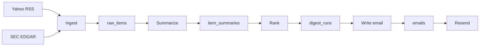

# Stock News — Weekly Investor Digest

A personal, once-a-week email of the most useful news and filings for a small named watchlist. You are the only user. Config lives in `app/profiles/`, not a signup product.

Yahoo Finance RSS plus SEC EDGAR (8-K, 10-Q, 10-K, and filtered Form 4s) → Postgres → three OpenAI steps (summarize, rank, write) → Jinja2 Arcane email → Resend. GitHub Actions runs it on Sunday.

## Stack

| Piece | Choice |
|---|---|
| Language | Python 3.13 |
| Jobs | CLI (`digest`) |
| Cron | GitHub Actions (`0 12 * * 0`) |
| DB | Supabase Postgres |
| LLM | OpenAI (`gpt-4o-mini` for summarize + email; `gpt-4o` for rank) |
| Email | [Resend](https://resend.com) |
| Config | `app/profiles/user.py` + `app/profiles/tickers.py` |

No web server. Secrets live in `.env` locally and in GitHub Actions secrets in prod.

## Add a ticker

Append a dict in `app/profiles/tickers.py`:

```python
TICKERS = [
    {"symbol": "NVDA", "name": "NVIDIA"},
    {"symbol": "AAPL", "name": "Apple"},
    {"symbol": "MSFT", "name": "Microsoft"},
]
```

Persona, ranking criteria, email tone, and recipient are in `app/profiles/user.py`. CIK lookup happens at ingest from SEC’s `company_tickers.json` (cached under `data/`).

## Env vars

Copy `.env.example` to `.env`. Never commit `.env`.

| Name | Used for |
|---|---|
| `DATABASE_URL` | Direct Postgres URI (port `5432`, not the `6543` pooler) |
| `OPENAI_API_KEY` | Summarize / rank / write-email |
| `RESEND_API_KEY` | Send |
| `RESEND_FROM` | Verified From address |
| `SEC_USER_AGENT` | Name + email; EDGAR 403s without it |

Optional model overrides: `OPENAI_SUMMARIZE_MODEL`, `OPENAI_RANK_MODEL`, `OPENAI_EMAIL_MODEL`.

GitHub Actions injects the same names as secrets. It does not use a `.env` file.

## How to run

```bash
uv sync
uv run alembic upgrade head

# one step at a time
uv run python -m digest ingest
uv run python -m digest summarize
uv run python -m digest rank
uv run python -m digest write-email
uv run python -m digest send

# full pipeline (what cron runs)
uv run python -m digest run-weekly
uv run python -m digest run-weekly --force
```

`-v` turns on DEBUG (per-item progress, DB totals). `--force` replaces this week’s rank / email / send.

Idempotency: one digest per Monday UTC `week_start`. If this week already sent, `run-weekly` skips unless you pass `--force`.

After `write-email`, open `data/email-preview.html` in a browser to check layout without sending.

Helper checks (no pytest required for these):

```bash
uv run python playground/test_settings.py
uv run python playground/test_yahoo_news.py
uv run python playground/test_sec_filings.py
uv run python playground/test_form4.py
uv run python playground/test_raw_items_db.py
uv run python playground/test_agents_db.py
```

## Pipeline



1. **Ingest** — Yahoo Finance RSS (title + snippet + link) and SEC 8-K / 10-Q / 10-K excerpts (capped), plus Form 4s after a keep/drop filter (open-market buys and discretionary officer/director sales; no RSU/tax/10b5-1). Dedupe on `external_id`. Window: last 7 days.
2. **Summarize** — one cheap-model call per new item. Skip empty text.
3. **Rank** — one call over this week’s summaries. Top 5–10 ids. If fewer than 5 exist, keep what we have.
4. **Write email** — subject + 1–2 overview paragraphs from the model. Python renders Arcane HTML + plaintext from stored summaries.
5. **Send** — Resend. Fail the job if send fails.

`digest/` is the command menu. `app/services/` is ingest, send, and the weekly conductor. `app/agent/` is the three OpenAI steps. `app/config/` loads `.env` and the run context. `.env` stays at the repo root.

## Data model

Four tables, no user table:

- **`raw_items`** — `source` (`rss` \| `sec`), ticker, title, url, published_at, raw_text, unique `external_id`
- **`item_summaries`** — summary, why_it_matters, item_type, key_numbers
- **`digest_runs`** — one row per `week_start`; ranked ids + rationale
- **`emails`** — subject, html, text, send log (`unsent` / `sent` / `failed`)

## Sources that actually work

Verified 2026-09-03:

| Source | URL | Result |
|---|---|---|
| Yahoo Finance RSS | `https://feeds.finance.yahoo.com/rss/2.0/headline?s={TICKER}&region=US&lang=en-US` | Live. Use a descriptive User-Agent (`StockNewsDigest/0.1 …`). |
| Google News RSS | `https://news.google.com/rss/search?q={COMPANY}+stock&hl=en-US&gl=US&ceid=US:en` | Dropped. Often empty to a script. |
| SEC ticker → CIK | `https://www.sec.gov/files/company_tickers.json` | Live; cached at `data/company_tickers.json`. |
| SEC submissions | `https://data.sec.gov/submissions/CIK{cik10}.json` | Live with `SEC_USER_AGENT` set to name + email. |
| SEC Form 4 Atom | `browse-edgar?type=4&owner=only&output=atom` | Live. Only officer/director open-market buys and discretionary sales (not RSU, tax withholding, or 10b5-1) enter `raw_items`, max 2 per ticker. |

RSS stays title + snippet + link. Filings send a capped excerpt (about 8–12k characters), not the whole 10-K. Form 4s store a short parsed buy/sell line, not the XML.

## Repo layout

```
app/config/      # settings, run context, logging
app/services/    # ingest, send, weekly
app/scrapers/    # yahoo, rss_filter, edgar, sec, form4, schemas
app/agent/       # client, prompts, schemas; steps/ = summarize, rank, write_email
app/db/          # SQLAlchemy models + queries
app/email/       # Arcane templates
app/profiles/    # user.py + tickers.py
digest/          # CLI
alembic/         # migrations
```

## Later (not V1)

- IR RSS/Atom only where a company publishes one
- Price context (1-week move next to each item)
- Multi-user / hosted API
